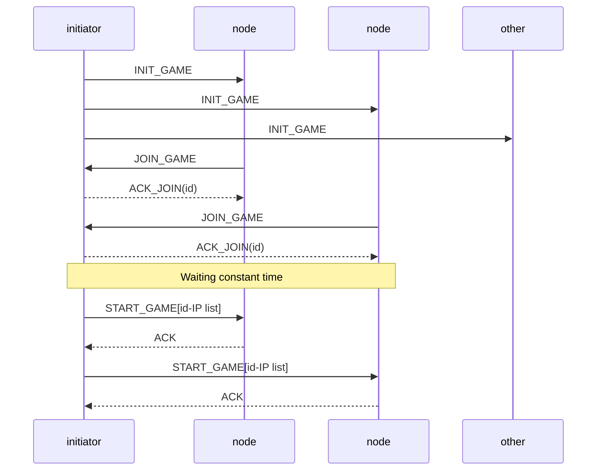
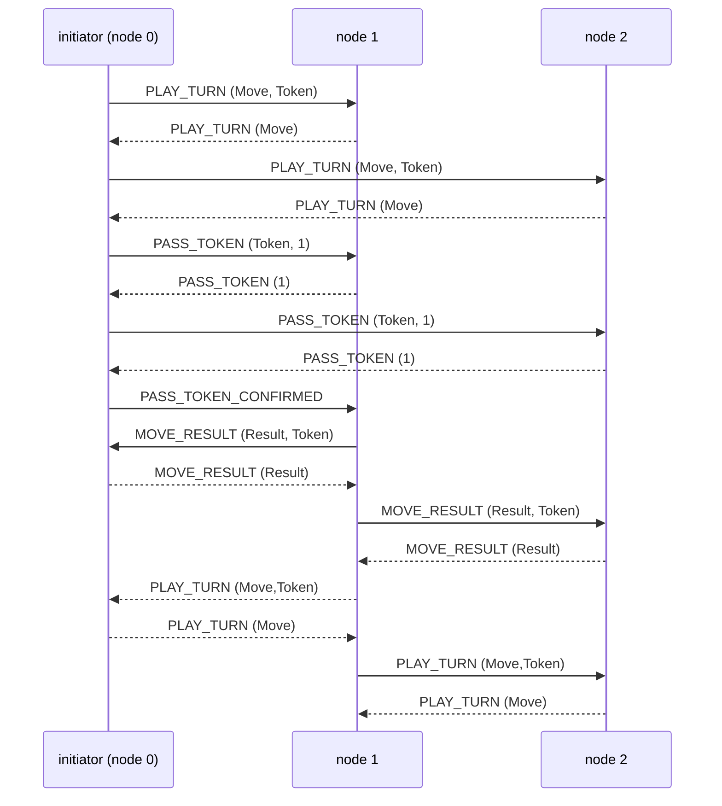
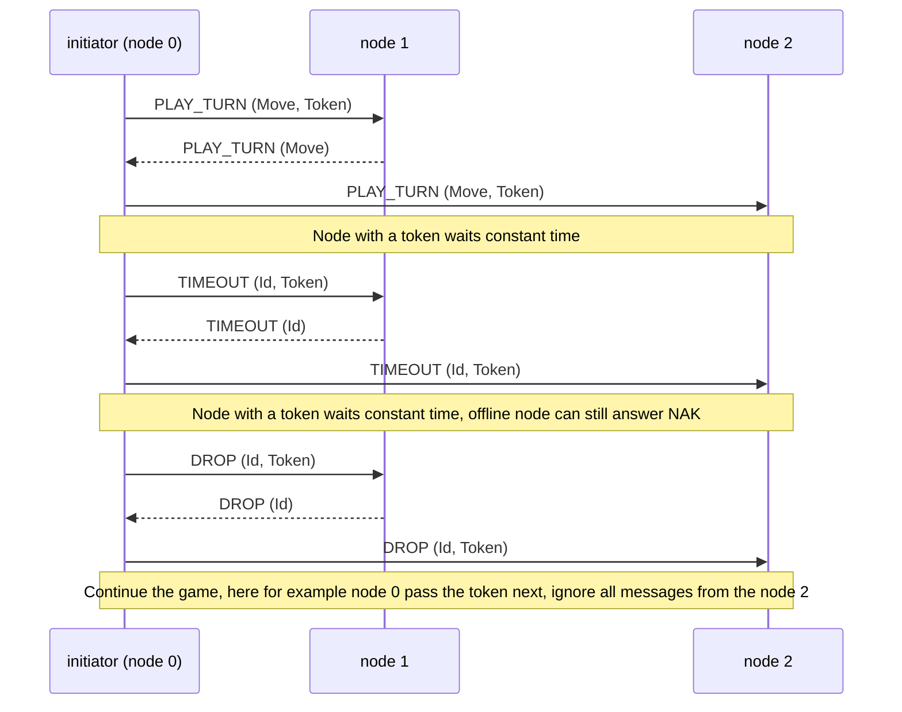
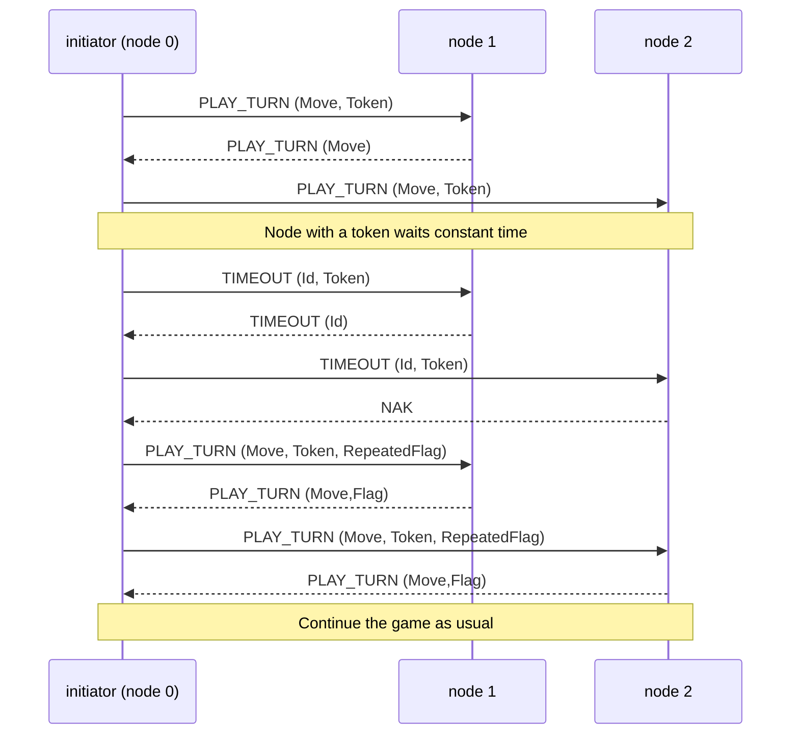
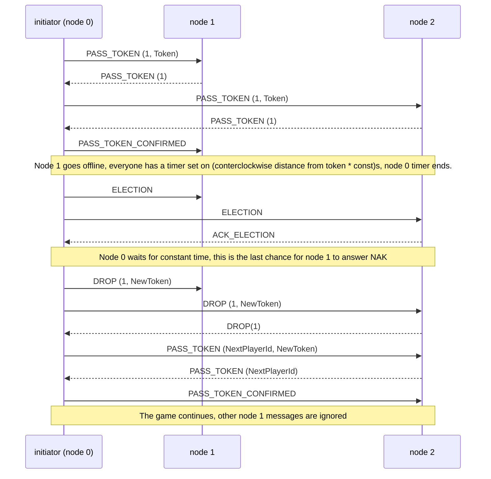
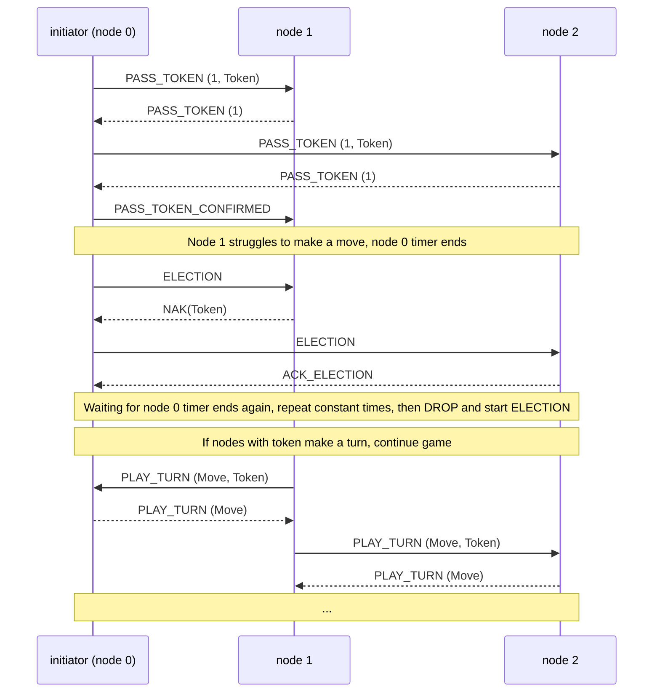
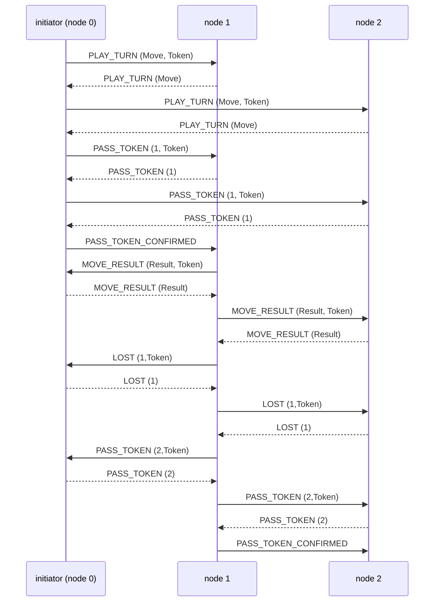

# Design Document for Best Battleship

## Team members

- Oleg Tervo-Ridor
- Toni Raeluoto
- Jonne Kanerva
- Guanghan Wu

## Project description

The topic of the group project is a [Battleship game](<https://en.wikipedia.org/wiki/Battleship_(game)>) for any number of players. The players are arranged into a virtual ring where they always have do attack the next player in the ring. A token is used to specify the current player and is also used as the main mechanism for synchronization, consistency and consensus. The game will use the standard rules described in the Wikipedia article linked at the start of this paragraph.

### Technologies

The program for the game will be implemented in Python. Communication between nodes will happen via sockets. The messages will be JSON payloads. User Interface will be a Command-line Interface.

### Nodes and their roles

All nodes will be identical. Each node will have the option to either try to initialize a new game with the other nodes or to wait for some other node to initialize the game. The initializing node will always have the first turn in the game, but that is the only differentiating factor between the nodes regarding any of the gameplay or the communication logic.

### Messages

The semantics of the messages are described in the [communication protocols](#).

The messages sent between the programs will be JSON payloads of the following format:

```
{message: "EVENT_NAME" [, data: {}]}
```

where `"EVENT_NAME"` will adhere to some command defined in the [communication protocols](#) and `data` is an object holding data relevant to the specific command. The token used for synchronization, consistency and consensus will be added to the `data` object when necessary.

## Distribution and properties

The game has its state distributed among the participating players and the main mechanism for synchronization, consistency and consensus is a token that grants the right to play a turn and send messages that mutate the state of other players.

Participating players are distributed into a virtual ring, with the token being passed to the next player
after playing a turn. When playing a turn, all participating players validate that the correct token was used. If a token is lost due to any reason (e.g. a player holding the token failing), a new one will be generated to provide fault tolerance to the system.

### Game loop (simplified)

The described (simplified) game loop shows our intuition considering how to use the token to guarantee synchronization, consistency and consensus by only allowing the token holder to send commands that mutate the shared state.

For more robust descriptions, see the [communication protocol sequence diagrams](#).

1. Token holder does their move to the next player in the virtual ring
2. Others validate
3. Token holder passes token to the next player
4. Others validate
5. New token holder checks their board for a lose condition
6. Others validate
7. Move to step 1

### Summary for properties of the distributed system

- **Shared distributed state**:
  - players, which is a list of tuples (id, ip, port, game board)
    - The order of the list is also the order of the ring
    - id is used to identify individual players in commands
    - ip and port are used to send messages via sockets
    - game board is used:
      - to attack by the token holder
      - to validate attacks by others
- **Synchronization and consistency** provided by requiring all players to acknowledge a command sent by the token holder
- **Consensus** provided by the property that only the token holder is allowed to make mutations to the shared distributed state
- **Fault tolerance** provided by remaining players generating a new token if player holding the token fails

\pagebreak

## Appendix A Communication sequence diagrams

### Game initialization



### Game Cycle



### Node timeout



### Node timeout recovery



### Token lost in game



### Token recovered



### Player lost or left the game


