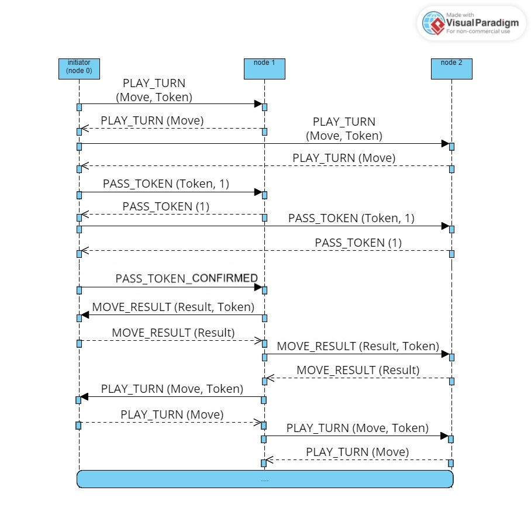
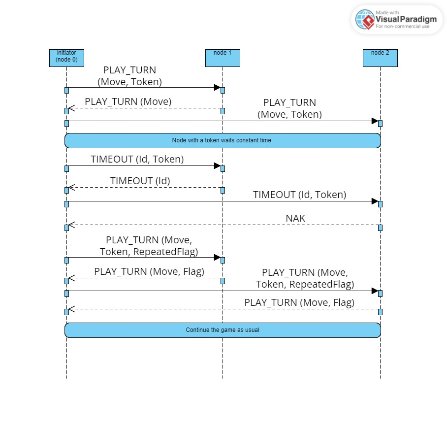
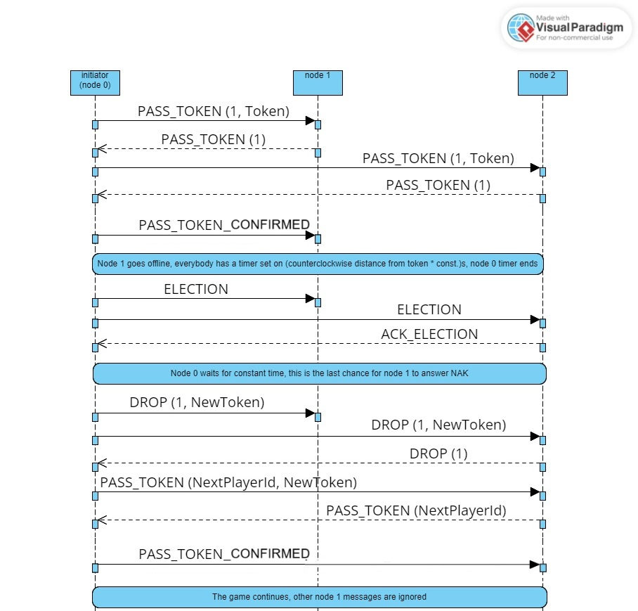
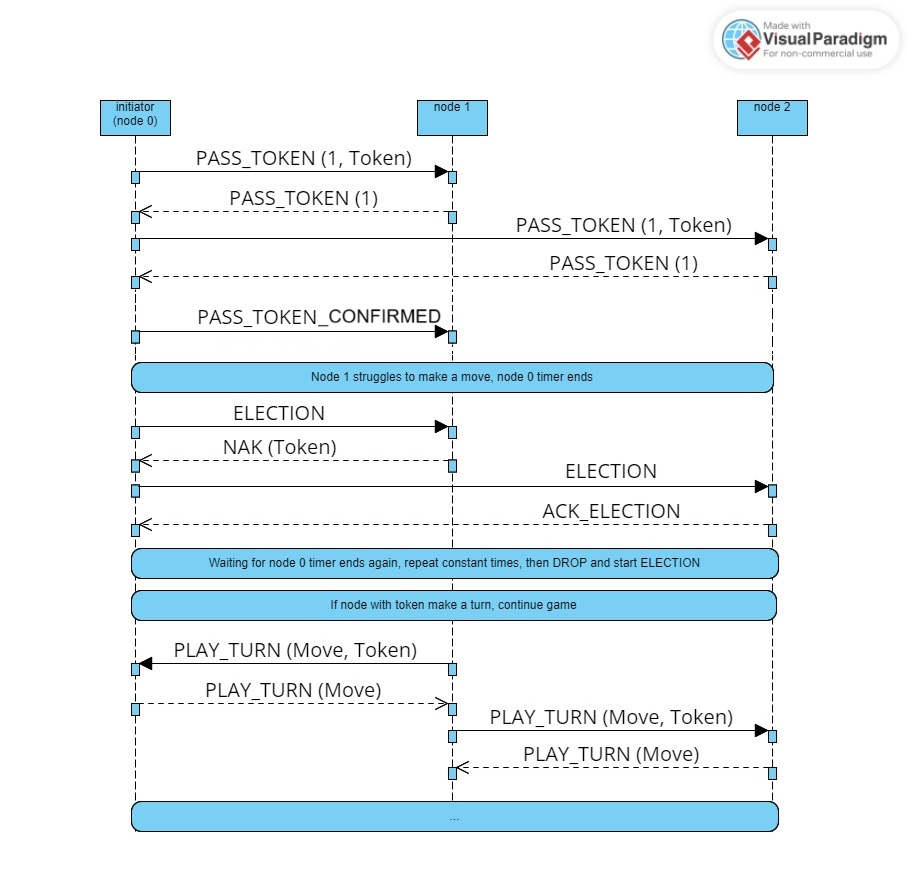

# Final Report for Best Battleship

\pagebreak

## Table of Contents

- [1. The project's goal and core functionality](#1-the-projects-goal-and-core-functionality)
- [2. Design Principles](#2-design-principles)
    - [Messages](#messages)
    - [Game loop (simplified)](#game-loop-simplified)
- [3. Distribution and properties](#3-distribution-and-properties)
- [4. Scaling](#4-scaling)
- [5. Performance](#5-performance)
- [6. Lessons learned](#6-lessons-learned)
- [7. Notes](#7-notes)
- [8. Appendix](#8-appendix)

## Team members

- Oleg Tervo-Ridor
- Toni Raeluoto
- Jonne Kanerva 
- Guanghan Wu

## 1. The project's goal and core functionality

The topic of the group project is a [Battleship game](https://en.wikipedia.org/wiki/Battleship_(game)) for any number of players. The players are arranged into a virtual ring where they always have do attack the next player in the ring. A token is used to specify the current player and is also used as the main mechanism for synchronization, consistency and consensus. The game uses the standard rules described in the Wikipedia article linked at the start of this paragraph.

The game is built as a Python program that can be run on arbitrary number of nodes that then communicate with each other. Node discovery is done by one of the nodes by broadcasting a game initialization message, which is then replied to by nodes that want to join that particular game. After a set amount of time, the initiating node starts the game and sends the relevant data (tuples (id, ip, port)) to all the participating nodes. After that the nodes start playing the game by following the protocols described in the appendix. Token holder is always known and both the token and the move are validated by all nodes, which provides synchronization, consistency and consensus to the system.

The idea of having a virtual ring and a token could be used to implement any turn-based game that can be played in such a ring. Battleship provides a fairly even playing ground, but something like chess could be implemented as well.

## 2. Design Principles

The main design principle is that we wanted every node to be identical in terms of functionality, which lead us to a peer-to-peer architecture. Each node can initiate a game and each node can join a game. The initiating node serves a special purpose only when initiating the game, after which it is in an identical state with all the participating nodes for the remainder of the operation. All mutations require consensus, which is provided all nodes acknowledging that the node triggering a mutation (i.e. playing a turn in the battleship game) holds a valid token and is trying to play a valid turn. Passing the token to the next node also requires acknowledgement from all participants.

The nodes are arranged into a virtual ring, in which the token is rotated. All moves are always done against the next player in the ring, which provides an equal playing ground, preventing e.g. some participants agreeing on destroying a specific opponent first. The nodes communicate via sockets using the UDP protocol. All communication is done with JSON messages, which contain the message (a string enum), possibly the token and relevant data for the message, such as the coordinates in case of a PLAY_TURN message. The game is built to work in the local network of the initializing node.

If a node stops answering, an election for dropping the node is triggered. If the node does not participate the election, they're dropped from the ring, while the other nodes can continue playing against each other.

### Messages

The semantics of the messages are described in the communication protocols provided as an appendix.

The messages sent between the programs will be JSON payloads of the following format:
```
{message: "EVENT_NAME" [, data]}
```

where `"EVENT_NAME"` will adhere to some command defined in the communication protocols and `data` can be any data relevant to the specific command. The token used for synchronization, consistency and consensus will be added to `data` when necessary.

An example message would be {message: "PLAY_TURN", "x": 3, "y": 3, "target_id": 2}.

### Game loop (simplified)

The described (simplified) game loop shows our intuition considering how to use the token to guarantee synchronization, consistency and consensus by only allowing the token holder to send commands that mutate the shared state.

For more robust descriptions, see the communication protocol sequence diagrams provided as an appendix.

1. Token holder does their move to the next player in the virtual ring
2. Others validate
3. Token holder passes token to the next player
4. Others validate
5. New token holder checks their board for a lose condition
6. Others validate
7. Move to step 1

## 3. Distribution and properties

The game has its state distributed among the participating players and the main mechanism for synchronization, consistency and consensus is a token that grants the right to play a turn and send messages that mutate the state of other players.

Participating players are distributed into a virtual ring, with the token being passed to the next player after playing a turn. When playing a turn, all participating players validate that the correct token was used. If a player times out for any command, an election is started and if the player does not participate the election, they're dropped from the virtual ring and cannot join the game anymore. The player that was attacking the dropped node will then be attacking the dropped node's target on their next turn.

- **Shared distributed state**:
    - players, which is a list of tuples (id, ip, port, game board)
        - The order of the list is also the order of the ring
        - id is used to identify individual players in commands
        - ip and port are used to send messages via sockets
        - game board is used:
            - to attack by the token holder
            - to validate attacks by others
            - NOTE: game board is individually generated by all nodes: empty board for all other players and a board with ships for the node itself
- **Synchronization and consistency** provided by requiring all players to acknowledge a command sent by the token holder
- **Consensus** provided by the property that only the token holder is allowed to make mutations to the shared distributed state, all moves are also acknowledged by all nodes
- **Fault tolerance** provided by dropping a player from the ring after an election if they do not answer in a timely manner, letting the others continue operation as usual

## 4. Scaling

The application has no hard limits on the number of players as the ring can theoretically hold any number of players, but realistically the number of players is restricted to the size of the local network of the initializing node, as node discovery is done by broadcasting within the local network.

## 5. Performance

To reduce the affect on network, we use multicast messages instead of broadcasts after the game starts. Message acknowledgement is sent with a direct UDP message. UDP protocol is also chosen to reduce ports usage on nodes and message amount in the network.

## 6. Lessons learned

One key learning is that it is imperative to think on the architecture / interface lavel especially when working asynchronously as splitting the work can be difficult if the code organization does not support that.

It is also not trivial to come up with mechanisms that provide the desired properties in a distributed system like this, such as node discovery or consensus.

Practiced UDP sockets, multicast and broadcast in real application. It was an interestin experience to develop and implement protocols. Learned message loose problems related to UDP protocol and recovery mechanisms.

Learned how to develop distributed systems and how to think about one system running on many computers and iteract with others. Got a better understanding of consistency and consensus in practice.

Should have maybe used a library for socket/UDP stuff?

## 7. Notes

We agree to divide the points equally.

\pagebreak

## 8. Appendix

### Appendix A Communication sequence diagrams












